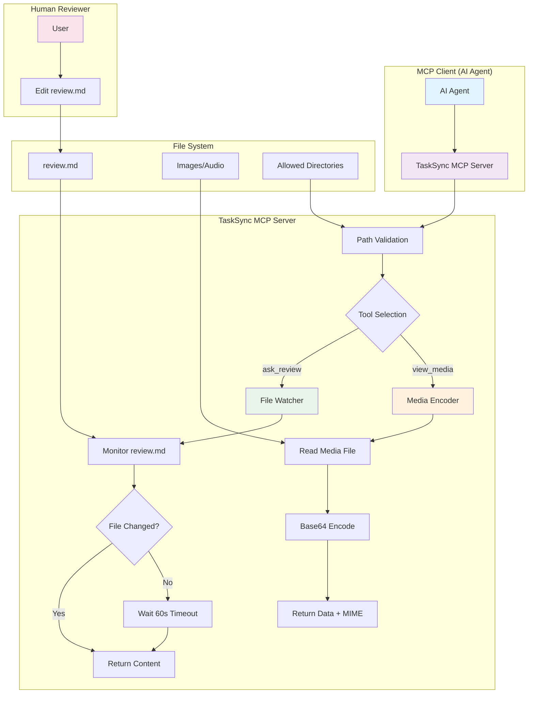

# TaskSync MCP Server

A Node.js server implementing the Model Context Protocol (MCP) designed for automated workflows and continuous feedback loops. TaskSync provides specialized tools for file system operations, media handling, and real-time review feedback collection.

## Installation

### NPX (Recommended)

Run directly without installation:

```bash
npx tasksync-mcp-server /path/to/directory
```

### Global Installation

```bash
npm install -g tasksync-mcp-server
tasksync-mcp-server /path/to/directory
```

### Local Installation

```bash
npm install tasksync-mcp-server
npx tasksync-mcp-server /path/to/directory
```

## One-Click Installation for VS Code

### For VS Code
[](vscode:extension/install-mcp-server?package=tasksync-mcp-server)

### For VS Code Insiders  
[](vscode-insiders:extension/install-mcp-server?package=tasksync-mcp-server)

> **Note**: These buttons will prompt VS Code to install and configure the TaskSync MCP server automatically. Make sure you have the MCP extension installed in VS Code first.

### Manual VS Code Configuration
If the one-click installation doesn't work, you can manually add this configuration to your VS Code MCP settings:

```json
{
  "servers": {
    "tasksync": {
      "command": "npx",
      "args": ["-y", "tasksync-mcp-server", "${workspaceFolder}"]
    }
  }
}
```

## How TaskSync Works



## Key Features

### 🔄 Continuous Review Feedback
- **ask_review** tool that watches `tools/review.md` for real-time feedback
- File watcher automatically detects changes and notifies waiting processes
- Supports partial content reading with head/tail parameters
- Essential for iterative development and user feedback loops

### 📁 Secure File Operations
- Read text and binary files with path validation
- **view_media** tool for images and audio files with base64 encoding
- Symlink attack prevention and security validation
- Support for multiple file formats (PNG, JPEG, MP3, WAV, etc.)

### 🔐 Dynamic Access Control
- Directory access control via command-line arguments or MCP Roots
- Real-time directory permission updates
- Auto-detection of current directory when no paths specified

## Available Tools

### 🔍 ask_review
**Purpose**: Real-time feedback 

- Monitors `tools/review.md` for changes using file watcher
- Returns content immediately if file has been modified
- Waits for file changes if content is unchanged (60-second timeout)
- Critical for automated feedback loops and user interaction
- Cannot specify both head and tail parameters simultaneously

### 🖼️ view_media
**Purpose**: Read and encode binary media files

- Supports image formats: PNG, JPEG, GIF, WebP, BMP, SVG
- Supports audio formats: MP3, WAV, OGG, FLAC
- Returns base64-encoded data with proper MIME type
- Efficient streaming for large files
- Respects directory access controls

## Server Modes

### Standard Mode (stdio)
Default MCP behavior for direct client integration:
```bash
tasksync-mcp-server /path/to/directory
# or
tasksync-mcp-server /path/to/directory --stdio
```

### SSE Mode (Server-Sent Events)
Web-based integration with HTTP endpoints:
```bash
tasksync-mcp-server /path/to/directory --sse --port=3001
```

**Available endpoints:**
- `GET /sse` - Server-Sent Events for real-time communication
- `POST /messages` - Message handling endpoint
- `GET /health` - Server status and configuration info

## Configuration

## Directory Access Control

The server uses a flexible directory access control system with multiple configuration methods:

### Method 1: Command-line Arguments
Specify allowed directories when starting the server:

```bash
tasksync-mcp-server /path/to/dir1 /path/to/dir2
```

### Method 2: MCP Roots (Recommended)
Dynamic directory management via MCP client capabilities:

```json
{
  "mcpServers": {
    "tasksync": {
      "command": "npx",
      "args": ["tasksync-mcp-server"],
      "roots": [
        {
          "name": "project",
          "uri": "file:///path/to/project"
        }
      ]
    }
  }
}
```

### Auto-Detection
If no directories are specified, the server automatically allows the current working directory:

```bash
cd /my/project
tasksync-mcp-server  # Automatically allows /my/project
```

## Security Features

### Path Validation
- All file paths are validated against allowed directories
- Symlink attack prevention with real path resolution
- Parent directory verification for new file creation

### Safe File Operations
- Atomic file writes to prevent race conditions
- Exclusive creation flags prevent symlink exploitation
- Normalized path handling across different platforms

### Access Control
- Directory boundaries strictly enforced
- Real-time permission updates via MCP Roots
- Comprehensive logging of access attempts

## Development

### Building
```bash
npm run build
```

### Testing
```bash
npm test
```

### Development Server
```bash
npm run dev         # Start in stdio mode
npm run dev:sse     # Start in SSE mode
```

## Example MCP Client Configuration

### Claude Desktop
```json
{
  "mcpServers": {
    "tasksync": {
      "command": "npx",
      "args": ["tasksync-mcp-server"],
      "roots": [
        {
          "name": "workspace",
          "uri": "file:///Users/you/workspace"
        }
      ]
    }
  }
}
```

### VS Code MCP Extension
```json
{
  "servers": {
    "tasksync": {
      "command": "npx",
      "args": ["-y", "tasksync-mcp-server", "${workspaceFolder}"]
    }
  }
}
```

### Custom Client
```typescript
import { Client } from "@modelcontextprotocol/sdk/client/index.js";

const client = new Client(
  { name: "my-client", version: "1.0.0" },
  { capabilities: { roots: {} } }
);

// Use stdio transport
const transport = new StdioClientTransport({
  command: "npx",
  args: ["tasksync-mcp-server", "/path/to/allowed/directory"]
});

await client.connect(transport);
```

## Workflow Integration

TaskSync is designed for automated workflows requiring human feedback:

1. **Automated Process**: AI agent performs tasks
2. **Review Request**: Agent calls `ask_review` to request feedback
3. **Human Review**: User edits `tools/review.md` with feedback
4. **Automatic Detection**: File watcher detects changes
5. **Process Continuation**: Agent receives feedback and continues

This creates a seamless human-in-the-loop automation system perfect for:
- Code review workflows
- Content creation pipelines  
- Quality assurance processes
- Interactive development environments

## License

MIT
