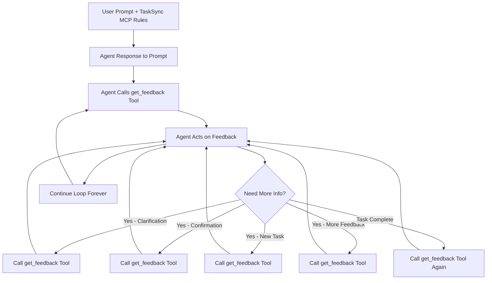

# TaskSync MCP Server

This is an MCP server that helps with  feedback-oriented development workflows in AI-assisted development by letting users give feedback while the agent is working. It uses the `get_feedback` tool to collect your input from the `feedback.md` file in the workspace, which is sent back to the agent when you save. By guiding the AI with feedback instead of letting it make speculative operations, it reduces costly requests and makes development more efficient. With an additional tool that allows the agent to view images in the workspace. 

## 🌟 Key Features

#### 🔄 Continuous Review Feedback
- **get_feedback** tool that reads `feedback.md` for real-time feedback
- Automatically creates `feedback.md` if it doesn't exist in the workspace
- File watcher automatically detects changes and notifies waiting processes
- Essential for iterative development and user feedback loops

#### 🖼️ Media Processing
- **view_media** tool for images files with base64 encoding
- Supports image formats: PNG, JPEG, GIF, WebP, BMP, SVG
- Efficient streaming for large files with proper MIME type detection

## 🛠️ Quick Setup

</details>

Add to `mcp.json`:
```json
{
  "mcpServers": {
    "tasksync": {
      "command": "npx",
      "args": ["-y", "tasksync-mcp-server@latest", "/path/to/workspace"]
    }
  }
}
```
For VS Code:
```json
 {
    "servers": {
        "tasksync": {
        "command": "npx",
        "type": "stdio",
        "args": ["-y", "tasksync-mcp@latest", "b:\\download"]
        }
    }
}
```

</details>

## 🔨 Available Tools

- **get_feedback** - Read feedback.md file for user review/feedback (creates file if missing)
- **view_media** - Read image (returns base64 with MIME type)


## Workflow Example

1. **User Prompt + TaskSync MCP Rules** - User provides a request/task
2. **Agent Response** - Agent responds to the prompt AND calls `mcp_tasksync_get_feedback` tool
3. **Agent Acts Accordingly** - Based on feedback, agent will call the tool again if needing:
   - More clarification
   - Confirmation
   - Information
   - New task assignment
   - Additional feedback
4. **Continuous Loop** - After completing user tasks/questions, agent calls the tool again
5. **Loop Forever** - This continues indefinitely until user stops the chat



## 🛟 Best Practices

### Agent Rules for Optimal Performance

For best results with TaskSync, add these rules to your AI agent configuration:

```
# MCP TaskSync Server Tool Rules

Strictly follow mcp_tasksync_get_feedback tool usage rule description and instructions. Continue loop forever.
```

## License

This MCP server is licensed under the MIT License. This means you are free to use, modify, and distribute the software, subject to the terms and conditions of the MIT License. For more details, please see the LICENSE file in the project repository.

